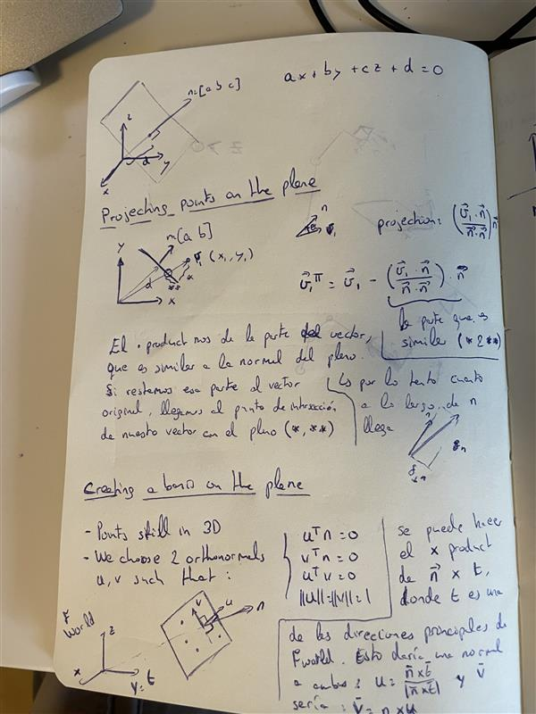

# scan_and_detect

## Docker Deployment

1. Open Terminal in Container:
    ```bash
    docker exec -it docker-scan_and_plan bash
    ```

2. Install Dependencies:
    ```bash
    cd workspace
    sudo apt update
    rosdep update
    rosdep install --from-paths . --ignore-src -r -y
    ```

3. Build Workspace:
    ```bash
    source /opt/ros/humble/setup.bash
    colcon build --mixin release --symlink-install --cmake-args -DCMAKE_BUILD_TYPE=Release -DCMAKE_POLICY_VERSION_MINIMUM=3.5
    ```

---

## PCL Utils Library

The `pcl_utils` ROS2 package provides point cloud processing, ellipsoid fitting, and viewpoint generation capabilities for robotic scanning applications.

### Core Modules

#### 1. Point Cloud Processing (`pointcloud_processing.py`)
Basic point cloud operations and filtering:
- **Plane removal**: RANSAC-based table/ground plane segmentation
- **DBSCAN clustering**: Extract individual objects from scenes
- **Statistical outlier removal**: Noise filtering
- **Mesh reconstruction**: Poisson and ball-pivoting algorithms
- **ROS message conversion**: Convert between Open3D and ROS PointCloud2/Mesh formats

#### 2. Ellipsoid Fitting (`ellipsoid_fitting.py`)
Object shape approximation and camera viewpoint planning:
- **2D projection and convex hull extraction**: Project 3D objects onto planes
- **Ellipse fitting**: Fit 2D ellipses to object perimeters using OpenCV
- **3D ellipsoid generation**: Transform 2D ellipses to 3D upper-hemisphere ellipsoids
- **Viewpoint generation**: Compute camera positions around objects for optimal scanning coverage
- **Visualization tools**: Plot fitted shapes and viewpoint configurations

##### Geometric Implementation

The ellipsoid fitting algorithm follows a multi-step geometric transformation process:

**Step 1: 3D to 2D Projection**



The 3D object point cloud is projected onto the detected table plane, creating a 2D representation of the object's footprint.


**Step 3: 2D to 3D Transformation**


The 2D ellipse parameters (center, axes, rotation) are transformed back to 3D space, with the height dimension computed from the original point cloud.

**Step 4: Viewpoint Generation**


Camera viewpoints are generated around the ellipsoid surface at specified standoff distances and elevation angles for optimal scanning coverage.

#### 3. Point Cloud Registration (`pointcloud_registration.py`)
Alignment and registration of multiple point clouds:
- **Feature-based registration**: FPFH descriptors for initial alignment
- **ICP refinement**: Iterative Closest Point for precise alignment
- **Voxel downsampling**: Efficient feature computation

#### 4. ROS Helper (`open3d_ros_helperV2.py`)
Conversion utilities between ROS2 and Open3D data types:
- Transform/pose conversions (SE3, quaternions)
- PointCloud2 to Open3D conversions
- Pass-through filtering

### Dependencies

- ROS2 Humble
- Open3D
- NumPy
- OpenCV (cv2)
- SciPy
- Matplotlib
